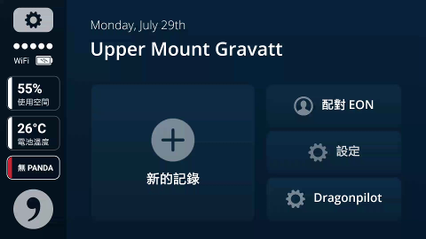
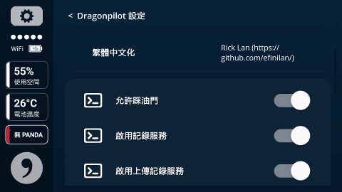
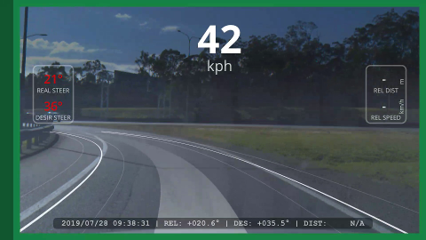
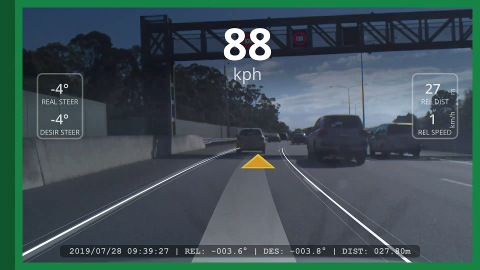
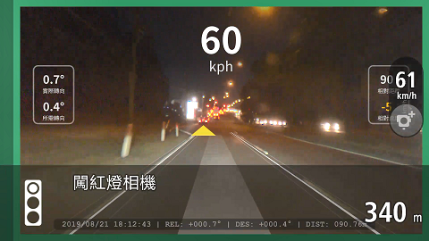

1-Step installation
一步安装
---
```bash
cd /data/ && \
mv openpilot op_backup_$(date +%Y%m%d%H%M%S) && \
git clone https://github.com/dragonpilot-community/dragonpilot.git openpilot -b devel-i18n && \
cd openpilot/scripts/ && \
./reset_update.sh
```

dragonpilot (aka dp)
---
dragonpilot is a modded version of [openpilot](https://github.com/commaai/openpilot/) with features including:  
dragonpilot 驾驶辅助系统是一套基于 openpilot 的开源 L2 級驾驶系统软件，它可以升級您原车的 ACC (自适应巡航) 以及 LKAS (车保保持辅助) 至接近特斯拉 Autopilot 的等級。dragonpilot 在 openpilot 的基础上加入更多定制化的功能，目前有
* Multi-language interface (Fully support: English, Simplified/Traditional Chinese, partial support: Japanese, Korean, French, Portuguese, German)
* 多语言介面(目前支援：英文、简体、繁体，部分支援：日文、韩文、法文、葡萄牙语)
* drive recording.
* 不间断行车记录
* Configurable driving UI.
* 可设定的行车界面
* Auto Shutdown.
* 自动关机
* Temporarily disable steering control when Turn signal / direction light is on.
* 打转向灯/方向灯暂时取消方向盘控制
* Disallow AI training video recording.
* 停止AI 训练记录
* Disallow upload of AI training video recording.
* 取消AI 训练记录上传
* Allow gas/throttle access while engaging.
* dp 控制时可踩油门
* Full Speed Fan Mode.
* 全时高速风扇模式
* Ability to disable driver monitoring.
* 取消驾驶员监控
* ACC Only Mode: No steering assist.
* 仅ACC 模式：让dp 只操控油门/刹车
* Integrated with TOM TOM Speed Camera (Global) / Autonavi (China) / Ainvest (Taiwan) / Waze (Global).
* TOM TOM 测速照相/ 高德地图/ 神盾测速照相/ 位智(Waze)
* Allow Panda/C2 GPS signal passthru to 3rd Party Apps. 
* 允许panda或C2的GPS信号传递给第三方APP
* Integrated with MiXplorer File Manager.
* 内置MiXplorer文件管理器
* Display WIFI IP Address on sidebar.
* 侧边栏显示无线网路IP地址
* Automated Lane Change.
* 自动变道
* Enable Hotspot/Tethering on Boot.
* 开机启动个人热点
* Adjustable Lead Car Following Profile. (longitudinal, aka Dynamic Following by @ShaneSmiskol: https://github.com/ShaneSmiskol/)
* 动态调整车距(只支援由dp 控制车速的车种，Toyota 需拔DSU，感谢@ShaneSmiskol 提供相关代码)
* Turn off screen while reversing. (by @mlp: https://github.com/martinl/)
* 倒车时关闭画面
* Turn off screen while driving.
* 行驶时关闭画面
* Custom Car Model selector. (fingerprint-less mode)
* 自定义车辆模型选择器（无指纹模式）
* Support ZSS Mod.
* 支援ZSS 模块
* Ability to use LQR on all models. (based from RAV4 tune, result may vary)
* 选用LQR 控制器(基于RAV4 调校，不同车种的效果不一)

Additional Model Support
支持的车型
---
We support the following additional car models (v0.6.4+):
除了官方支持的车型外，dp (0.6.4以上版本) 还支持以下车款：
* China Honda Inspire Hybrid by KT
* 大陆版东风本田Inspire 混动by KT
* China Honda Accord Hybrid
* 大陆版本田雅阁混动
* China 2018 Toyota Camry 2.0 by Rming
* 大陆版2018 丰田凯美瑞 2.0 by Rming
* China 2018 Toyota Highlander by toyboxZ
* 大陆版2018 T丰田汉兰达 by toyboxZ
* China 2018 Toyota Camry by 笨木匠
* 大陆版2018 丰田凯美瑞 by 笨木匠
* China 2020 Toyota RAV4 by 笨木匠
* 大陆版2020 丰田 RAV4 by 笨木匠
* China 2019 Toyota Levin (Petrol) by Shell
* 大陆版2019 丰田雷凌(汽油版) by Shell
* China 2019 Lexus RX300 by cafe
* 大陆版2019 Lexus RX300 by cafe
* China 2019 Toyota Corolla (Petrol) by Shell
* 大陆版2019 Toyota 卡罗拉(汽油版) by Shell
* Taiwan 2016 Toyota Prius by Philip
* 台湾版2016 Toyota Prius by Philip
* Taiwan 201? Toyota RAV4 4WD 5th Gen by Philip
* 台湾版201? Toyota RAV4 4WD 5th Gen by Philip
* Taiwan 2020 Toyota Auris w/ LTA by Philip
* 台湾版2020 Toyota Auris w/ LTA by Philip
* Taiwan 2017 Lexus IS200t by Philip / Cody Dai
* 台湾版2017 Lexus IS200t by Philip / Cody Dai
* Taiwan 2019 Toyota RAV4 Hybrid by MaxDuan
* 台湾版2019 Toyota RAV4 Hybrid by MaxDuan
* Taiwan 2019 Toyota RAV4 by MaxDuan / CloudJ
* 台湾版2019 Toyota RAV4 by MaxDuan / CloudJ
* Taiwan 2019 Toyota Corolla Altis by wlee72
* 台湾版2019 Toyota Corolla Altis by wlee72
* Taiwan Lexus CT200h by CloudJ
* 台湾版Lexus CT200h by CloudJ
* Taiwan Toyota Prius 4.5 Gen by Lin Xin Hong
* 台湾版Toyota Prius 4.5 代by Lin Xin Hong
* Taiwan 2017 Lexus GS450h by 簡銘佑
* 台湾版2017 Lexus GS450h by 简铭佑
* Poland 2015 Lexus NX200T by wabes
* 波兰版2015 Lexus NX200T by wabes
* Volkswagen MQB/PQ platform (special thanks to @jyoung8607 & @dingliangxue)
* 大众MQB / PQ平台车型（特别感谢@jyoung8607 和@dingliangxue）
使用画面截图
---
     

**Please see screenshots/ Folder**
**更多请看screenshots/ 资料夹**
Videos
视频
---
<table>
  <tr>
    <td><a href="https://www.youtube.com/watch?v=-Womm0aO8Cc" title="YouTube" rel="noopener"></a></td>
    <td><a href="https://www.youtube.com/watch?v=ACrHqodnhKI" title="YouTube" rel="noopener"></a></td>
    <td><a href="https://www.youtube.com/watch?v=lovEJU_Y7eI" title="YouTube" rel="noopener"></a></td>
    <td><a href="https://www.youtube.com/watch?v=fb0KEZgqH1Y" title="YouTube" rel="noopener"></a></td>
  </tr>
</table>

Installation
安装
---
 
1. SSH into your device
通过SSH方式连接并进入你的设备（手机）
2. Switch to /data/ directory 
切换到/data/ 文件夹
    ```bash
    cd /data
    ```
3. back up existing openpilot (optional)
备份旧版的openpilot
    ```bash
    mv openpilot op_backup_$(date +%Y%m%d%H%M%S)
    ```
4. download dragonpilot development version to openpilot directory from github or gitee:
载dragonpilot 开发版并存至openpilot 资料夹(2 选1):
    * github 
    ```bash
    git clone https://github.com/dragonpilot-community/dragonpilot.git openpilot -b devel-i18n
    ```
    * gitee
    ```bash 
    git clone https://gitee.com/dragonpilot-community/dragonpilot.git openpilot -b devel-i18n
    ```
5. switch into openpilot directory
切换到openpilot 的文件夹
    ```bash
    cd openpilot
    ```
6. update git repository again just in case
更新git 资料库
    ```bash
    git pull
    ```
7.  Reboot
重启
    ```bash
    reboot
    ```

**Please reboot again if you have display issue. (Chinese / Japanese / Korean only)**
**如果遇到显示问题，请重启. (中文 / 日文 / 韩文 的时候)**

Update
更新
---
1. switch to /data/openpilot directory 
切换至/data/openpilot 文件夹
    ```bash
    cd /data/openpilot/scripts/
    ```
2. run update command
执行更新指令
    ```bash
    ./reset_update.sh
    ```

Versions
版本说明
---
* docs: Manual
* 说明文件
* testing: Alpha quality - (i18n，Based on openpilot devel-staging/devel branch + customisation + new features, may contain bugs/errors)
* 抢鲜版- (英文，基于官方devel-staging/devel 版+ 定制化功能，可能会有问题、错误)
* feature-????: new feature testing branch - (i18n，based on dp testing branch + customisation + new features, may contain bugs/errors)
* 新功能测试版- (英文，基于dp testing 版+ 新功能测试，可能会有问题、错误)
* devel-i18n: beta quality - (i18n, based on dp testing branch, less bugs/errors)
* 开发版- (多语言版，基于dp testing 版)
* ?.?.?-i18n: stable release - (i18n, based on devel-i18n branch, more stable than devel-i18n but may still contain bugs/errors)
* 稳定版- (多语言版，测试过的devel-i18n)

**Always stick with beta/stable version unless you know what you are doing.**
**其它没有说明的分支为测试功能版，非必要请勿使用**
